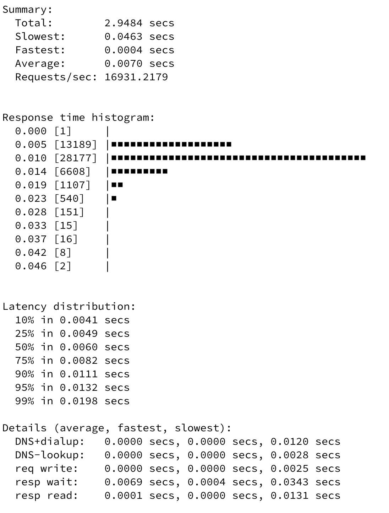

A Link Shortener in TruffleRuby
===============================

This is a PoC link shortener implemented in TruffleRuby and backed by Cassandra
or ScyllaDB. It generates 12-digit random shorten codes, and will repetably
generate the same code for the same URL as long as it has not expired.
Expiration is handled by Cassandra TTLs on the records.

This application is written in Ruby but uses the Java libraries for a number of
functions, including the Sinatra-like Spark web framework (and Jetty
webserver), the Datastax Cassandra driver and query tooling, and the Bloom
filter from the Guava library.

Basic throughput testing locally shows that this service can handle about
15k-17k *shorten* requests per second. After warmup on my machine I can manage
nearly 17k/second running the default settings for Spark, backed by Scylladb.
Not too bad for under 300 lines of code.



Running It
----------

As an proof-of-concept in building a TruffleRuby application, I experimented
with how to handle Java dependencies. It turns out to be pretty nice to manage
them with Maven.  Hence it is required to have `mvn` in your path in order to
manage the dependencies.  This is required in order to download the appropriate
jars to run the application.

I have included a `Makefile` to make some of this easier, and it has proper
help output if you simply run `make`. If you'd rather invoke the scripts
directly, you can use the following commands.

You may install and manage the dependencies by running:
```
./deps
```

This will install all the required libraries and overwrite the `cp.txt` file,
which contains the classpath, constructed by Maven.

Running the service requires having the classpath loaded. To make that easy, I
have included a script to wrap TruffleRuby with the correct classpath settings.
You may start the application like so:

```
./run serve.rb
```

That will start the Spark framework and Jetty webserver and begin serving
traffic.

Starting Cassandra
------------------

Before running the service locally, you will need to start ScyllaDB. This is
done with `docker-compose up -d` or `podman compose up -d`.

I prefer `podman` and you will find that the Makefile commands use `podman`.

Once the service is up, you need to install the schema. Make may do this with:

```
make schema
```

Configuration
-------------

This application is configured via environment variables. It supports the following:

 * `BASE_URL` - the base URL from which the server will run. Used to generate
   the correct shortened links. default: `http://localhost:4567/r`
 * `CASSANDRA_HOST` - the IP address/DNS name at which to reach the Cassandra host.
   default: `127.0.0.1`
 * `CASSANDRA_PORT` - the port on which to reach Cassandra. default: `9042`

The default is to run a simple one node Cassadra/ScyllaDB cluster with no replication.
If you were to put this into production, you would want to do better. This, and
the TTL for links, are defined in `schema.cql`.

API
---

The API for this service is quite simple and supports the following endpoints:

### `GET /shorten?url=<url>`

This will return a payload like:
```json
{
   "data" : {
      "short_code" : "tkAZYPaHmSuI",
      "shortened_url" : "http://localhost:4567/r/tkAZYPaHmSuI",
      "sum" : "99999ebcfdb78df077ad2727fd00969f",
      "url" : "https://google.com"
   }
}
```

### `GET /lookup?code=<short_code>`

Response payload is like:

```json
{
   "data" : {
      "short_code" : "aaaaaaaaaaaa",
      "shortened_url" : "http://localhost:4567/r/aaaaaaaaaaaa",
      "sum" : "d41d8cd98f00b204e9800998ecf8427e",
      "url" : ""
   }
}
```

### `GET /r/<short_code>`

This returns no payload and simply sends a 302 redirect to the location stored
for the corresponding short code. On a missing code, an error is returned:

```json
{"error":"code not found"}
```
